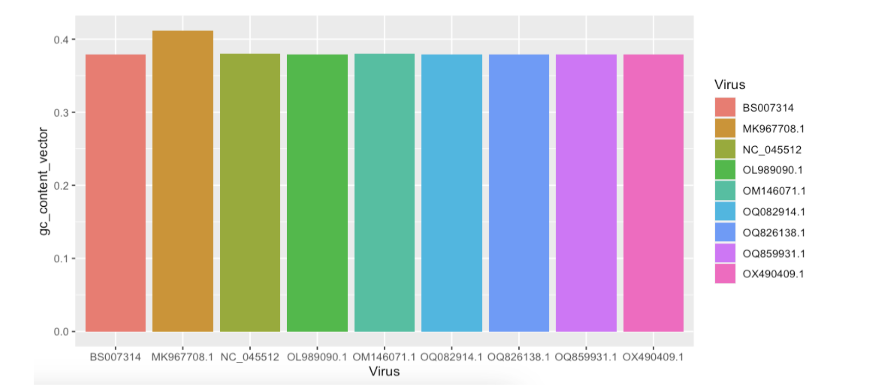

# Virus Analysis Toolkit 
### Computational Analysis of Biology - Análisis de Biología Computacional 
To run this project, you need [RStudio](https://posit.co/download/rstudio-desktop/).
You can run either `main.R` or `secondary.R`. 

 

This project uses the following dependencies:
- Viridis 
- Biostrings 
- DECIPHER
- Seqinr
- Ade4
- Adegenet 
- Ape 
- GGTree
- GGPlot2 

